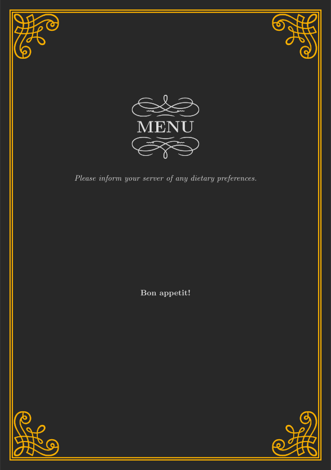
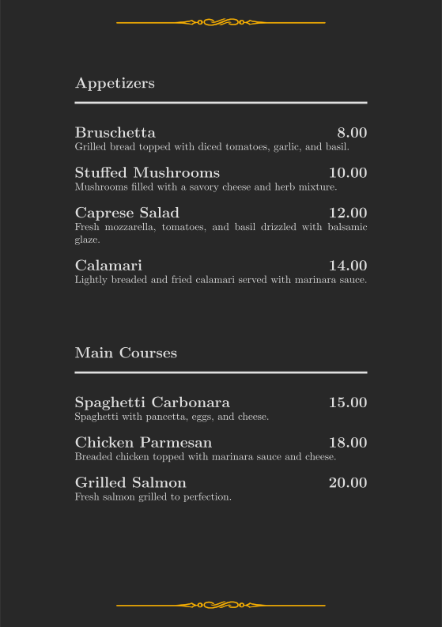
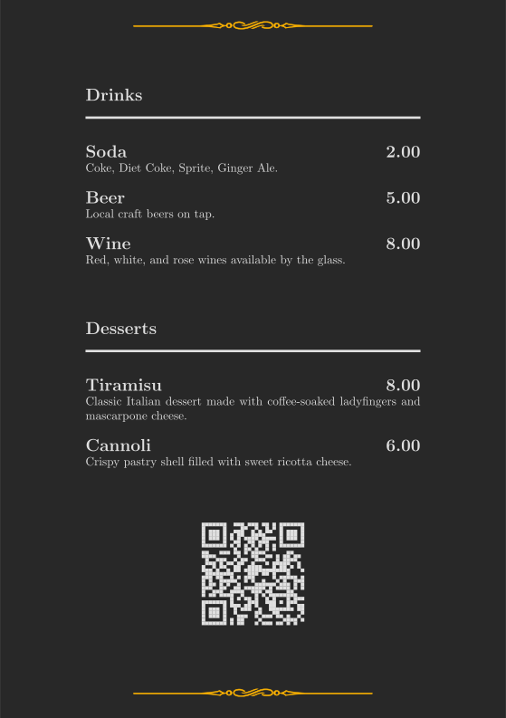
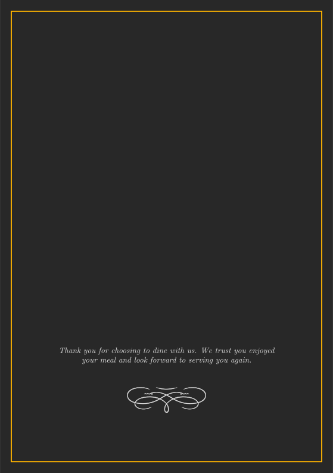

# Menu

A latex template resembling a generic restaurant menu.

<p float="left">
    
    
    
    
</p>

## Build

> Note: During the build process, two documents are created - `build/menu.pdf`
> and `build/menu-leaflet.pdf`. For the leaflet creation, the document is
> assumed to be 4 pages long. They are then arranged in such a fashion as to
> create a foldable leaflet when printed on A4 paper. Should your menu not
> contain exatly 4 pages, this will obviously fail.

### Build manually

```bash
$ make
```

### Build using docker

1. Build docker image
   ```bash
   $ docker build -f Dockerfile . -t menu
   ```
2. Build examples
   ```bash
   $ docker run --rm -v $PWD:$PWD -w $PWD -u `id -u`:`id -g` menu make
   ```
